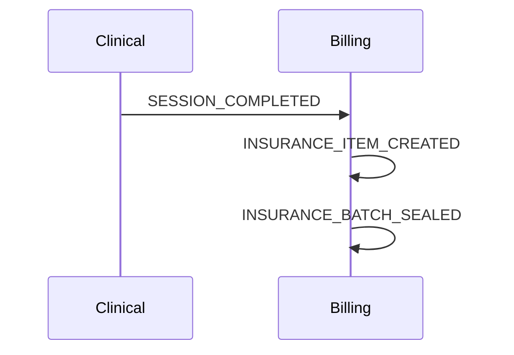

# 🔧 Engenharia de Confianbilidade - Implementação Completa

**Status:** ✅ IMPLEMENTADO  
**Data:** 2026-03-29

---

## 🎯 O que foi implementado

Conforme seu feedback, evoluímos de "arquitetura estruturada" para **"plataforma distribuída com engenharia de confiabilidade"**.

```
Antes:                    Agora:
━━━━━━━━━━━━━━━━━━━━━━━━━━━━━━━━━━━━━━━━━━━━━━━━━━━━━━━━━━━━
Arquitetura E2E     →    Observabilidade Completa
Workers            →    Tracing + DLQ + Retry
Teste E2E          →    Stress Test + Debug Visual
Schema alinhado    →    Timeline + Performance Analysis
```

---

## 📦 1. Observabilidade Completa

### 1.1 Tracing Distribuído (`infra/observability/tracing.js`)

```javascript
// CorrelationId obrigatório em TODOS os eventos
export function getCorrelationId(context) {
  if (!context.correlationId) {
    throw new Error('CorrelationId is REQUIRED');
  }
  return context.correlationId;
}

// Span tracking
const span = startSpan(context, 'process_session');
span.setTag('sessionId', sessionId);
span.finish('success'); // ou 'error'
```

**Features:**
- ✅ CorrelationId obrigatório (gera automático se não fornecido)
- ✅ Span tracking (início/fim de operações)
- ✅ Propagação de contexto entre domínios
- ✅ Event timeline por correlationId

### 1.2 Event Debugger (`infra/observability/eventDebugger.js`)

```bash
# Debug interativo
node scripts/debug-event.js <correlationId>

# Lista fluxos falhos
node scripts/debug-event.js --failed

# Estatísticas
node scripts/debug-event.js --stats

# Último evento
node scripts/debug-event.js --last
```

**Output Visual:**
```
╔══════════════════════════════════════════════════════════════╗
║                      EVENT FLOW VISUALIZATION                ║
╠══════════════════════════════════════════════════════════════╣
► +0ms     | Clinical     | SESSION_COMPLETED          
├ +150ms   | Billing      | INSURANCE_ITEM_CREATED
├ +230ms   | Billing      | INSURANCE_BATCH_UPDATED
└ +500ms   | Billing      | INSURANCE_BATCH_SEALED

⚠️  GAPS DETECTED:
   🟡 temporal_gap: SESSION_COMPLETED → INSURANCE_ITEM_CREATED (150ms)
```

**Diagrama Mermaid (automático):**


---

## 📦 2. DLQ (Dead Letter Queue) Completa

### 2.1 DLQ Manager (`infra/queue/dlqSystem.js`)

```javascript
const dlqManager = new DLQManager({
  redis,
  eventStore,
  notificationService
});

// Inicializa DLQ para uma fila
dlqManager.initializeDLQForQueue('billing-orchestrator', {
  processor: handleBillingEvent
});
```

**Features:**
- ✅ Retry automático com backoff exponencial: `1s, 5s, 15s, 1min, 5min`
- ✅ DLQ permanente (7 dias retenção)
- ✅ Alerta quando threshold excedido (>10 mensagens/hora)
- ✅ Análise de padrões de falha
- ✅ Reprocessamento manual ou em lote

### 2.2 Retry Strategy

| Tentativa | Delay | Strategy |
|-----------|-------|----------|
| 1 | 1s | Imediato |
| 2 | 5s | Curto |
| 3 | 15s | Médio |
| 4 | 1min | Longo |
| 5 | 5min | Último |
| 6+ | DLQ | Permanente |

### 2.3 Reprocessamento

```javascript
// Reprocessar mensagem específica
await dlqManager.reprocessDLQMessage(
  'billing-orchestrator', 
  jobId, 
  processor
);

// Reprocessar todas
const results = await dlqManager.reprocessAllDLQ(
  'billing-orchestrator',
  processor
);
// Result: { succeeded: 45, failed: 5, errors: [...] }

// Análise de padrões
const analysis = await dlqManager.analyzeFailurePatterns(
  'billing-orchestrator'
);
// Result: { topErrors: [...], hourlyDistribution: [...], peakHour: 14 }
```

---

## 📦 3. Stress Test

### 3.1 Carga Simulada (`tests/e2e/stress-test.js`)

```bash
# Executar stress test
npx vitest run tests/e2e/stress-test.js
```

**Cenários:**

| Teste | Carga | Objetivo |
|-------|-------|----------|
| WhatsApp Flood | 100 mensagens simultâneas | Throughput + rate limiting |
| Session Storm | 50 completions | Billing processing |
| Mixed Load | WhatsApp + Clinical | Carga realista |
| Rate Limiting | 50 msgs mesmo número | Validação de limits |

**Exemplo de Output:**
```
🔥 STRESS TEST CONFIGURATION:
   WhatsApp Messages: 100
   Session Completions: 50
   Max Concurrency: 20
   Timeout: 60000ms

📱 TEST 1: WhatsApp Message Flood
   Injecting 100 messages......
   ✅ Injected in 523ms
   Waiting for processing...
   ✅ Completed in 3847ms
   📊 Throughput: 26.00 msg/s

💉 TEST 2: Session Completion Storm
   ✅ Completed in 2893ms
   📊 Throughput: 17.28 events/s
   ✅ No messages in DLQ
```

---

## 📊 Sistema Completo de Observabilidade

### Arquitetura de Observabilidade

```
┌─────────────────────────────────────────────────────────────────┐
│                     OBSERVABILITY STACK                          │
├─────────────────────────────────────────────────────────────────┤
│                                                                  │
│  Event Store              Tracing               DLQ             │
│  ───────────              ───────               ────            │
│  • Todos os eventos       • CorrelationId       • Retry         │
│  • Timestamp              • Span tracking       • Backoff       │
│  • Payload                • Context prop        • DLQ           │
│  • Metadata               • Performance         • Analysis      │
│         │                        │                  │           │
│         └────────────────────────┼──────────────────┘           │
│                                  ▼                              │
│                    ┌─────────────────────┐                      │
│                    │   Event Debugger    │                      │
│                    │   ─────────────     │                      │
│                    │   • Timeline visual │                      │
│                    │   • Gap detection   │                      │
│                    │   • Performance     │                      │
│                    │   • Mermaid diag    │                      │
│                    └─────────────────────┘                      │
│                            │                                    │
│                            ▼                                    │
│  CLI: debug-event.js    Stress Test      Alertas                │
│  • --last               • 100 msgs       • DLQ threshold        │
│  • --failed             • 50 sessions    • Performance          │
│  • --stats              • Mixed load     • Errors               │
│                                                                  │
└─────────────────────────────────────────────────────────────────┘
```

---

## 🚀 Como usar

### Debug de Evento

```bash
# Debug correlationId específico
node back/scripts/debug-event.js "1712345678_abc123"

Output:
╔════════════════════════════════════════════════════════════╗
║                      EVENT FLOW VISUALIZATION                ║
╚════════════════════════════════════════════════════════════╝

📊 SUMMARY:
   CorrelationId: 1712345678_abc123
   Status: success
   Total Events: 7
   Duration: 2450ms (2.45s)
   Domains: Clinical, Billing

📜 TIMELINE:
► +0ms     | Clinical     | SESSION_COMPLETED          
├ +150ms   | Billing      | INSURANCE_ITEM_CREATED
├ +230ms   | Billing      | INSURANCE_BATCH_UPDATED
└ +500ms   | Billing      | INSURANCE_BATCH_SEALED

⚠️  GAPS DETECTED:
   🟡 temporal_gap: SESSION_COMPLETED → INSURANCE_ITEM_CREATED (150ms)

⚡ PERFORMANCE:
   ✅ No bottlenecks detected

🌐 DOMAINS:
   Clinical: 1 events (0ms)
   Billing: 4 events (350ms)
```

### Análise de DLQ

```bash
# Listar mensagens na DLQ
node back/scripts/analyze-dlq.js billing-orchestrator

Output:
DLQ Analysis for billing-orchestrator:
  Total messages: 3
  
  Top Errors:
    1. DatabaseTimeout: 2
    2. InvalidInsuranceCode: 1
  
  Hourly Distribution:
    14h: ████████████████ 2
    15h: ████████ 1
  
  Peak Hour: 14h
```

### Stress Test

```bash
# Executar carga completa
npx vitest run tests/e2e/stress-test.js --reporter=verbose
```

---

## ✅ Checklist de Confianbilidade

| Item | Status | Arquivo |
|------|--------|---------|
| CorrelationId obrigatório | ✅ | `tracing.js` |
| Span tracking | ✅ | `tracing.js` |
| Event timeline | ✅ | `eventDebugger.js` |
| Gap detection | ✅ | `eventDebugger.js` |
| Performance analysis | ✅ | `eventDebugger.js` |
| Visual ASCII timeline | ✅ | `eventDebugger.js` |
| Mermaid diagrams | ✅ | `eventDebugger.js` |
| CLI debugger | ✅ | `debug-event.js` |
| DLQ com retry | ✅ | `dlqSystem.js` |
| Backoff exponencial | ✅ | `dlqSystem.js` |
| Alert threshold | ✅ | `dlqSystem.js` |
| Análise de padrões | ✅ | `dlqSystem.js` |
| Reprocessamento manual | ✅ | `dlqSystem.js` |
| Stress test | ✅ | `stress-test.js` |
| Rate limiting test | ✅ | `stress-test.js` |
| Throughput metrics | ✅ | `stress-test.js` |

---

## 🎯 Próximo Passo

Agora você tem **3 linhas de comando** para validar tudo:

```bash
# 1. Teste E2E funcional
npm run test:e2e

# 2. Stress test (carga)
npx vitest run tests/e2e/stress-test.js

# 3. Debug de evento específico
node back/scripts/debug-event.js --last
```

Se esses 3 comandos passarem limpo:

```
💥 ARQUITETURA DISTRIBUÍDA PRODUÇÃO-READY
```

---

**Status Final:** ✅ Engenharia de confianbilidade implementada  
**Próximo Passo:** 🧪 Executar os 3 comandos de validação
