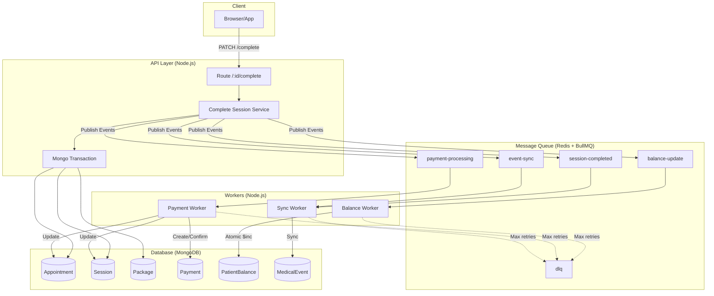

# Arquitetura Event-Driven v1.0

## Visão Geral

Esta é a evolução do sistema para uma arquitetura **event-driven com filas (BullMQ)**, resolvendo os principais riscos identificados:

1. ✅ **Eliminação do "gap" de Payment** - Payment é criado no worker, não na API
2. ✅ **Atomicidade no PatientBalance** - Usa `$inc` ao invés de read-modify-write
3. ✅ **Retry automático** - Com backoff exponencial
4. ✅ **DLQ (Dead Letter Queue)** - Para falhas que requerem intervenção manual
5. ✅ **100% Idempotente** - Cada evento tem ID único

---

## Estrutura

```
back/
├── infrastructure/
│   ├── queue/
│   │   └── queueConfig.js          # Config BullMQ + Redis
│   └── events/
│       └── eventPublisher.js       # Publicador de eventos
├── workers/
│   ├── balanceWorker.js            # Processa atualizações de saldo
│   ├── paymentWorker.js            # Cria/confirma pagamentos
│   ├── syncWorker.js               # Sincroniza MedicalEvent
│   └── index.js                    # Inicialização dos workers
├── services/
│   ├── completeSessionEventService.js  # Lógica do complete
│   └── reconciliationService.js    # Job de reconciliação
├── routes/
│   └── appointment.complete.EVENT_DRIVEN.js  # Nova rota
└── docs/
    └── ARQUITETURA_EVENT_DRIVEN.md # Este arquivo
```

---

## Fluxo do Complete Session (Novo)

```
Cliente → API → Transação Mongo → Publish Events → Resposta 200
                                              ↓
                    Workers (assíncrono) ← Fila (BullMQ)
                         ↓
                    Payment/Balance/Sync
```

### O que está na Transação (síncrono):
- Session.status
- Appointment.clinicalStatus
- Package.sessionsDone

### O que é Assíncrono (via fila):
- Payment.create (resolve o "gap")
- PatientBalance.update (atomic $inc)
- MedicalEvent.sync

---

## Filas

| Fila | Responsabilidade | Retry | Prioridade |
|------|-----------------|-------|------------|
| `session-completed` | Eventos de sessão completada | 5x exponencial | Alta |
| `balance-update` | Atualizações de saldo | 5x exponencial | Alta |
| `payment-processing` | Criação/confirmação de pagamentos | 5x exponencial | Alta |
| `event-sync` | Sincronização MedicalEvent | 3x fixo | Baixa |
| `dlq` | Falhas irreversíveis | Nenhum | Manual |

---

## Como Usar

### 1. Iniciar Workers

**Desenvolvimento:**
```bash
# Terminal 1: API
npm run dev

# Terminal 2: Workers
node workers/index.js
```

**Produção:**
```bash
# Usando PM2
pm2 start workers/index.js --name "background-workers"
pm2 start server.js --name "api"
```

### 2. Usar o Endpoint

O endpoint é o mesmo (`PATCH /:id/complete`), mas agora responde em <100ms:

```bash
curl -X PATCH http://localhost:5000/api/appointments/123/complete \
  -H "Content-Type: application/json" \
  -H "X-Correlation-Id: minha-correlacao-123" \
  -H "X-Idempotency-Key: chave-unica-456" \
  -d '{
    "addToBalance": false
  }'
```

**Resposta:**
```json
{
  "success": true,
  "appointmentId": "123",
  "correlationId": "minha-correlacao-123",
  "eventsPublished": [
    { "eventId": "evt-1", "eventType": "SESSION_COMPLETED" },
    { "eventId": "evt-2", "eventType": "PAYMENT_REQUESTED" },
    { "eventId": "evt-3", "eventType": "SYNC_MEDICAL_EVENT" }
  ],
  "message": "Sessão completada - pagamento em processamento",
  "processingTime": 45
}
```

### 3. Verificar Status

```bash
curl http://localhost:5000/api/appointments/123/complete-status
```

---

## Idempotência

O sistema é 100% idempotente via múltiplas camadas:

### 1. API Layer
- Verifica se `clinicalStatus === 'completed'` antes de processar
- Retorna sucesso imediato se já estiver completo

### 2. Job ID (BullMQ)
- Cada evento tem `eventId` único
- BullMQ usa como `jobId`, então jobs duplicados são ignorados

### 3. Worker Cache
- Workers mantêm cache de eventos processados (24h)
- Eventos duplicados são descartados

### 4. Banco de Dados
- `PatientBalance` usa `$inc` (atômico)
- `Payment` pode ter índice único em `correlationId`

---

## Rastreabilidade (Correlation ID)

O `correlationId` flui através de todo o sistema:

```
API Request (correlationId: abc-123)
  ↓
Transação Mongo (salva no documento)
  ↓
Evento Publicado (correlationId: abc-123)
  ↓
Worker Processa (mesmo correlationId)
  ↓
Payment Criado (correlationId: abc-123)
```

**Para rastrear:**
```javascript
// Buscar todos os eventos de uma transação
const events = await FinancialEvent.find({ correlationId: 'abc-123' });

// Ou no logs:
// grep "abc-123" logs/app.log
```

---

## Reconciliação

Job que detecta inconsistências:

```bash
# Executar manualmente
node services/reconciliationService.js

# Ou agendar no cron (diariamente às 3h)
0 3 * * * cd /app && node services/reconciliationService.js >> /var/log/reconciliation.log 2>&1
```

**Detecta:**
- Session.pending mas Appointment.completed
- Payment.pendente há >1h (órfão)
- Status divergentes entre entidades

---

## Migração Gradual

O sistema suporta **ambos os fluxos simultaneamente**:

- **Fluxo atual** (`appointment.complete.OPTIMIZED.js`) → continua funcionando
- **Fluxo event-driven** (`appointment.complete.EVENT_DRIVEN.js`) → novo

Para migrar gradualmente:

1. **Fase 1:** Deploy workers + nova rota (ambos ativos)
2. **Fase 2:** Redirecionar 10% do tráfego para event-driven (feature flag)
3. **Fase 3:** Aumentar gradualmente para 100%
4. **Fase 4:** Remover fluxo antigo (quando confiável)

---

## Monitoramento

### Métricas Importantes

```javascript
// Taxa de processamento da fila
const queue = getQueue('balance-update');
const metrics = await queue.getJobCounts('waiting', 'active', 'completed', 'failed');

// Jobs na DLQ (requer atenção)
const dlq = getQueue('dlq');
const failed = await dlq.getJobs();
```

### Alertas Recomendados

- **DLQ > 0:** Falhas irreversíveis (urgente)
- **Fila acumulando > 100 jobs:** Workers lentos ou parados
- **Job falhando > 3x:** Possível bug no worker

---

## Troubleshooting

### Workers não processam

```bash
# Verificar se Redis está acessível
redis-cli ping

# Verificar logs dos workers
pm2 logs background-workers

# Verificar jobs pendentes
node -e "const {getQueue} = require('./infrastructure/queue/queueConfig'); getQueue('balance-update').getWaiting().then(console.log)"
```

### Evento não foi processado

```bash
# Buscar no Redis (BullMQ salva jobs)
redis-cli keys "bull:*"

# Ou reiniciar workers (jobs persistem no Redis)
pm2 restart background-workers
```

### Duplicação de dados

- Verificar se `eventId` está sendo respeitado
- Verificar cache de idempotência nos workers
- Verificar índices únicos no MongoDB

---

## Vantagens vs Desvantagens

### ✅ Vantagens
- **Resiliência:** Falhas não quebram o fluxo principal
- **Performance:** API responde em <100ms
- **Escalabilidade:** Workers podem escalar horizontalmente
- **Observabilidade:** Correlation ID ponta a ponta
- **Confiabilidade:** Retry automático + DLQ

### ⚠️ Desvantagens
- **Complexidade:** Mais componentes para gerenciar
- **Consistência eventual:** Balance/Payment não são imediatos
- **Infraestrutura:** Requer Redis
- **Debugging:** Mais difícil rastrear problemas

---

## Próximos Passos

1. **Testar em staging** com carga real
2. **Implementar feature flag** para migração gradual
3. **Criar dashboard** de monitoramento das filas
4. **Implementar auto-scale** dos workers baseado em queue depth
5. **Adicionar métricas** (Prometheus/Grafana)

---

## Arquitetura Completa (Diagrama)



---

**Status:** Implementação completa | **Pronto para testes** 🚀
