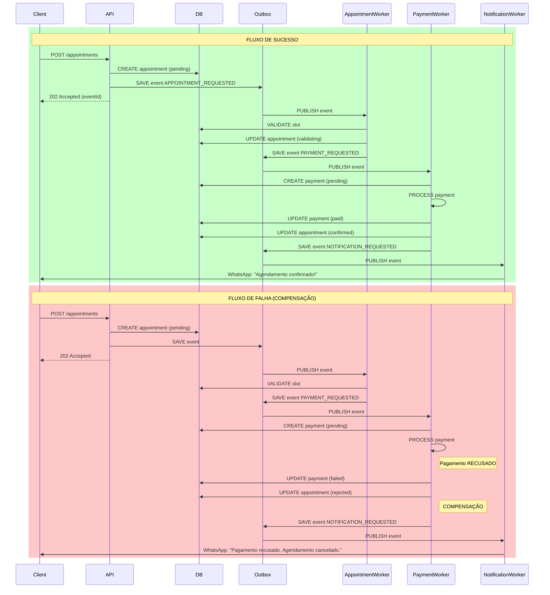

# Fluxo Completo - Agendamento + Pagamento

## Diagrama



## Estados do Agendamento

```
pending → validating → scheduled
              ↓              ↓
         rejected      completed
```

## Estados do Pagamento

```
pending → paid
    ↓
failed → (compensação cancela agendamento)
```

## Eventos

| Evento | Produtor | Consumidor | Ação |
|--------|----------|------------|------|
| APPOINTMENT_REQUESTED | API | AppointmentWorker | Valida e confirma |
| PAYMENT_REQUESTED | AppointmentWorker | PaymentWorker | Processa pagamento |
| PAYMENT_CONFIRMED | PaymentWorker | - | Confirma agendamento |
| PAYMENT_FAILED | PaymentWorker | - | Compensa (cancela) |
| NOTIFICATION_REQUESTED | Workers | NotificationWorker | Envia WhatsApp/email |

## Testar Local

```bash
# 1. Iniciar tudo
redis-server
mongod
node workers/index.js
npm run dev

# 2. Criar agendamento (sucesso)
curl -X POST http://localhost:5000/api/appointments \
  -d '{
    "patientId": "...",
    "doctorId": "...",
    "date": "2024-02-01",
    "time": "14:00",
    "amount": 200,
    "paymentMethod": "pix"
  }'

# 3. Verificar status
redis-cli keys "bull:*"
db.outboxes.find().pretty()
db.appointments.find().pretty()

# 4. Simular falha (10% chance no código)
# Rode várias vezes até ver uma compensação
```

## Métricas

```javascript
// Taxa de sucesso
const success = await Appointment.countDocuments({ 
    operationalStatus: 'scheduled' 
});
const failed = await Appointment.countDocuments({ 
    operationalStatus: 'rejected' 
});
const successRate = success / (success + failed);

// Tempo médio de processamento
// (do createdAt ao confirmedAt)
```
